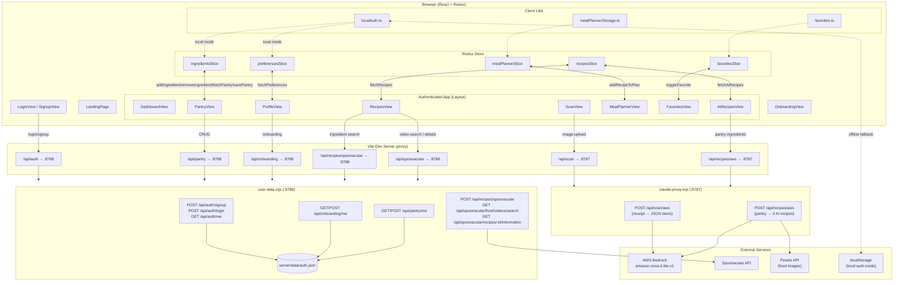
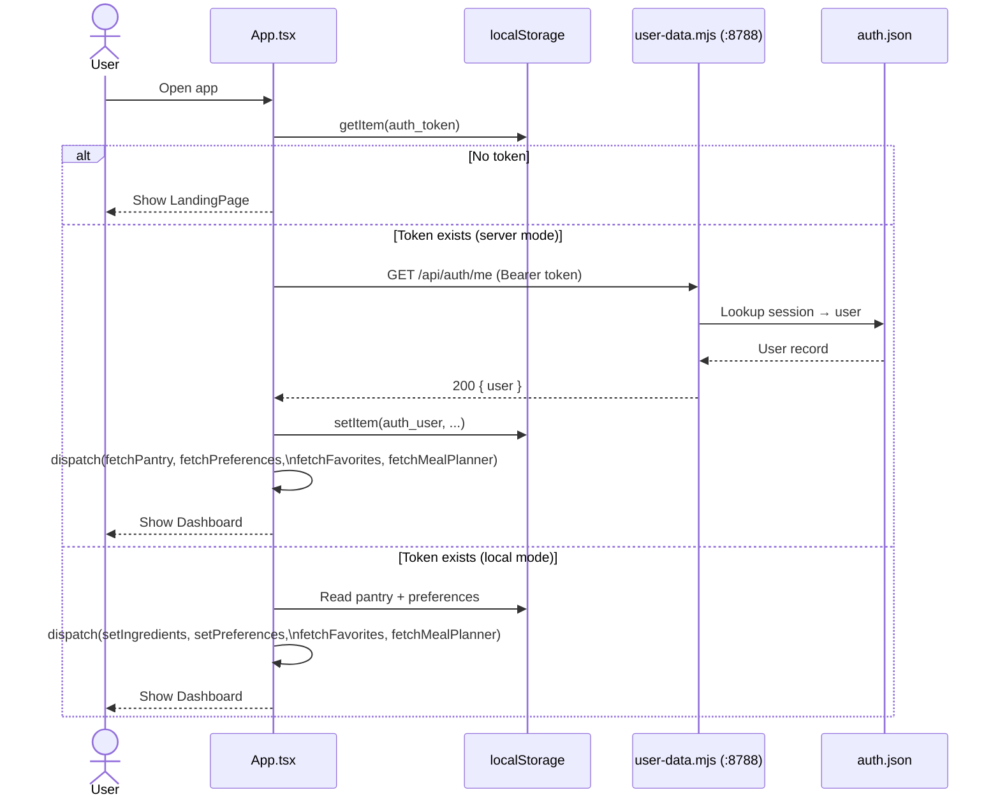
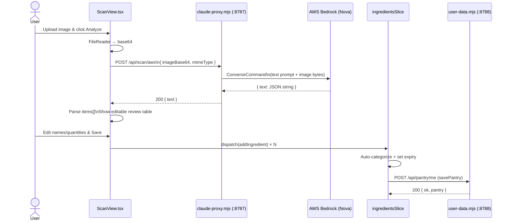
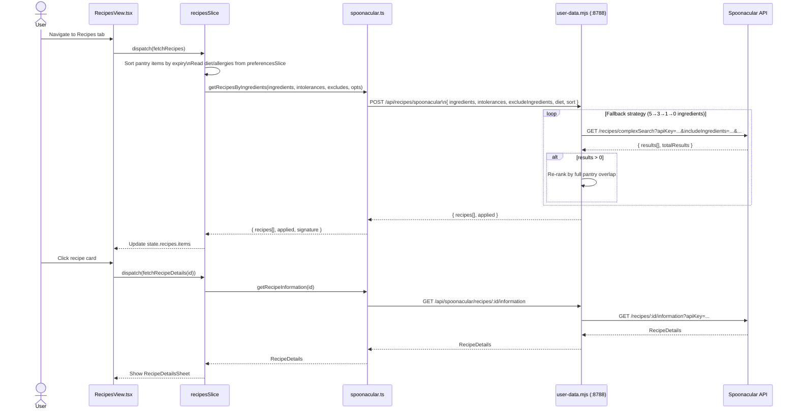
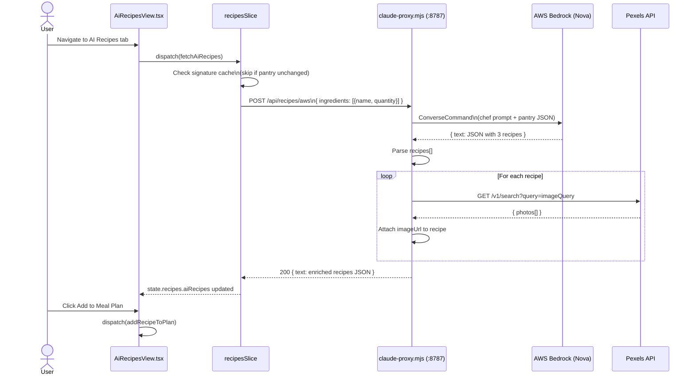

# PantryPal — Codebase Report

**Group #3 | PROG8950 Capstone | Conestoga College (Winter 2026)**

---

## Tech Stack

| Layer | Technology |
|---|---|
| Frontend | React 19, TypeScript, Vite 7, Tailwind CSS v4 |
| State Management | Redux Toolkit (RTK) |
| UI Components | Radix UI primitives, shadcn/ui, Framer Motion, GSAP |
| Backend (AI/Scan) | Node.js (`claude-proxy.mjs`) — AWS Bedrock (Nova) |
| Backend (Auth/Data) | Node.js (`user-data.mjs`) — file-backed JSON store |
| External APIs | Spoonacular (recipes & videos), Pexels (food photos) |
| Infra / AI | AWS Bedrock (`us.amazon.nova-2-lite-v1`) via AWS SDK v3 |

---

## Architecture Diagram



---

## Sequence Charts

### 1. User Login & Session Boot



### 2. Receipt Scan → Save to Pantry



### 3. Recipe Search (Spoonacular)



### 4. AI Recipe Generation (AWS Bedrock)



---

## Project Structure

```
PantryPal/
├── server/
│   ├── claude-proxy.mjs   # AWS Bedrock proxy (scan + AI recipes) — port 8787
│   ├── user-data.mjs      # Auth / pantry / Spoonacular proxy — port 8788
│   └── data/auth.json     # File-backed user/session store
├── src/
│   ├── App.tsx            # Root: session boot, view routing, Redux hydration
│   ├── types.ts           # Shared TypeScript interfaces
│   ├── components/
│   │   ├── views/         # 11 page-level view components
│   │   ├── ui/            # shadcn/ui primitives (button, card, dialog …)
│   │   ├── Layout.tsx     # Sidebar/tab shell
│   │   ├── LandingPage.tsx
│   │   ├── AddPantryItemModal.tsx
│   │   ├── RecipeDetailsModal.tsx
│   │   └── RecipeDetailsSheet.tsx
│   ├── store/
│   │   ├── index.ts       # Redux store config
│   │   ├── hooks.ts       # useAppDispatch / useAppSelector
│   │   └── slices/        # 5 RTK slices (ingredients, recipes, preferences, mealPlanner, favorites)
│   ├── services/
│   │   └── spoonacular.ts # Frontend API client (recipe search, video search, details)
│   └── lib/
│       ├── localAuth.ts   # localStorage-based auth (offline / demo mode)
│       ├── favorites.ts   # localStorage favorites persistence
│       └── mealPlannerStorage.ts  # localStorage meal planner persistence
└── vite.config.ts         # Dev proxy rules + path aliases
```

---

## Key Features & Flows

### 1. Authentication (Dual Mode)
- **Server mode** — credentials posted to `user-data.mjs`; scrypt-hashed passwords stored in `auth.json`; bearer token session.
- **Local mode** — full auth flow runs in `localStorage` (demo / offline). Falls back automatically when the server is unreachable.

### 2. Pantry Management
- Add items via manual form (`AddPantryItemModal`) or receipt scan.
- Auto-categorizes items (Produce, Dairy, Meat, Seafood, Spices, Condiments) and assigns default expiry dates by category.
- Persisted to server (`/api/pantry/me`) or `localStorage` depending on auth mode.

### 3. Receipt / Image Scanning
- User uploads image → base64 encoded → `POST /api/scan/aws`.
- `claude-proxy.mjs` sends multimodal prompt + image bytes to AWS Bedrock.
- Response JSON `{ items: [{name, quantity}] }` is reviewed and saved to pantry.

### 4. Recipe Search (Spoonacular)
- Pantry items sorted by expiry → passed as `includeIngredients`.
- User dietary preferences and allergies from onboarding applied as filters.
- Multi-strategy fallback: tries up to 5 ingredients, then 3, then 1, then no filter.
- Results re-ranked client-side by actual pantry ingredient overlap.

### 5. AI Recipe Generation (AWS Bedrock)
- Pantry items sent to `POST /api/recipes/aws`.
- Bedrock generates exactly 3 recipes with instructions, ingredient breakdown (`fromPantry` flag), and an `imageQuery`.
- Pexels API fetches a food photo per recipe using `imageQuery`.

### 6. Meal Planner & Favorites
- Both persisted to `localStorage` (user-scoped via `auth_user`).
- Meal planner generates a consolidated shopping list from planned recipes.

---

## Data Persistence Summary

| Data | Server Mode | Local Mode |
|---|---|---|
| User account | `auth.json` (scrypt hashed) | `localStorage` (plain password ⚠️) |
| Pantry | `auth.json` (per user) | `localStorage` |
| Onboarding prefs | `auth.json` (per user) | `localStorage` |
| Favorites | `localStorage` | `localStorage` |
| Meal Planner | `localStorage` | `localStorage` |

---

## Notable Issues / Risks

| # | Issue | Severity |
|---|---|---|
| 1 | `.env` contains real AWS & Spoonacular credentials — **rotate immediately** | Critical |
| 2 | Local auth mode stores passwords in plain text in `localStorage` | High |
| 3 | `auth.json` is a flat-file DB with no concurrency protection beyond atomic rename | Medium |
| 4 | No HTTPS enforced in dev; AWS credentials transmitted to a local Node process | Medium |
| 5 | Favorites and meal planner are not user-scoped on the server (localStorage only) | Low |
| 6 | Pexels API key not present in `.env.example`; silently skipped if missing | Low |

---

## Running Locally

```bash
# Install dependencies
npm install

# Terminal 1 — AWS Bedrock proxy (port 8787)
npm run dev:api

# Terminal 2 — Auth/Pantry/Spoonacular proxy (port 8788)
npm run dev:user

# Terminal 3 — Vite frontend (port 5173)
npm run dev
```

Required `.env` variables: `AWS_ACCESS_KEY_ID`, `AWS_SECRET_ACCESS_KEY`, `AWS_REGION`, `BEDROCK_MODEL_ID`, `PORT`, `SPOONACULAR_API_KEYS`, `USER_DATA_PORT`.
